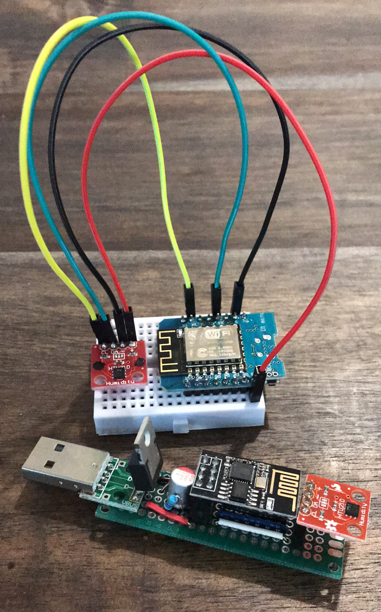
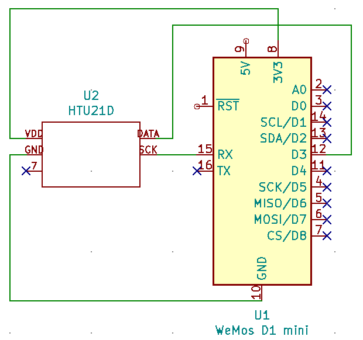
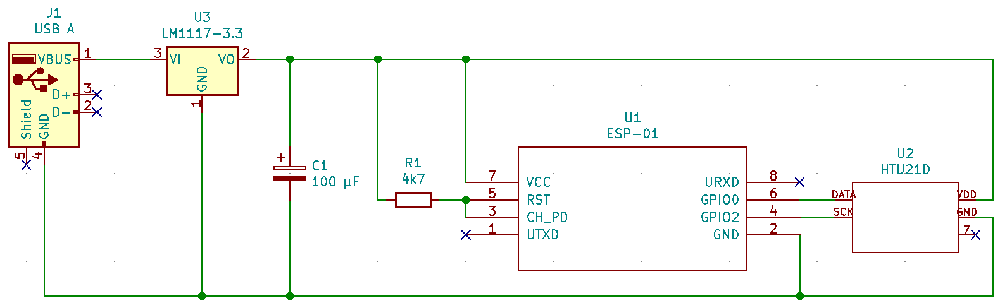

# Online plot of temperature data using ESP8266 and HTU21D chip thermometer
This repository contains code to plot temperature data gathered from ESP8266 WiFi sensors on a website. You can use whatever i2c sensor you want to. I happened to have a lot of HTU21D chip thermometers so I used those.

## What it looks like

_Figure 1. WeMos D1 mini on a breadboard with the HTU21D board alongside a more compact implementation using the ESP-01. The ESP-01 board can be powered from any USB charger so you can place these "WiFi sensors" wherever you please. The current draw is approximately 20 mA at 5 V_

## What's included
 1. Arduino sketch to program ESP8266
 2. Configuration files for NGINX and uwsgi
 3. Website to receive data from ESP8266 and plot data

Lines of the code containing the text "_Update this line_" require your attention. These lines contain configuration parameters such as your domain name, password etc. You can find all these lines by issuing `grep -r "Update this line" ./`.

## Try it out

It's very easy to try the code without the hassle of setting up NGINX and uwsgi.

1. Install Python and `pip install flask peewee`
2. Install Arduino and prerequisite packages
3. Configure `esp8266.ino` with proper WiFi credentials and IP address of the computer you'll use to run the flask server. Upload the code to the ESP8266.
4. Run `python webserver.py`
6. You can now see the data arriving in the command prompt and view it at http://127.0.0.1:8080.

## Prerequisites
### Hardware
 2. ESP8266, in my case a [WeMos D1 mini](https://docs.wemos.cc/en/latest/d1/d1_mini.html) or [ESP-01](https://en.wikipedia.org/wiki/ESP8266)
 3. [HTU21D breakout board](https://www.sparkfun.com/products/retired/12064) In practice, any i2c sensor will do

You can find the schematic for each ESP8266 device in Figure 2 and 3. All of these parts can be found on eBay.

_Figure 4. Schematic using WeMos D1 mini._

_Figure 4. Schematic using ESP-01._

### Software
1. Web server to host visualization site and to receive data from the ESP8266.
    I've used NGINX and uwsgi to host a website using the [Flask framework](https://flask.palletsprojects.com/) on a Debian server in the [DigitalOcean](https://www.digitalocean.com/) cloud.
2. [Arduino](https://www.arduino.cc/en/Main/Software) with the following additional libraries to program the ESP8266:
    a) [ESP8266 library](https://github.com/esp8266/Arduino)
    b) [HTU21D library](https://github.com/enjoyneering/HTU21D)
